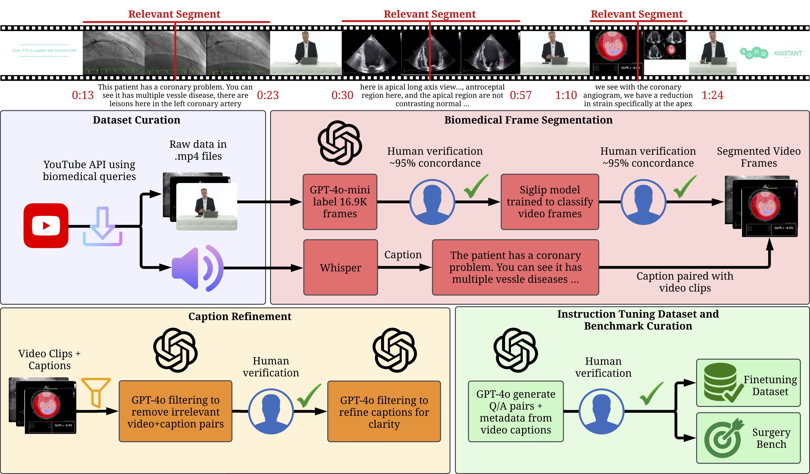
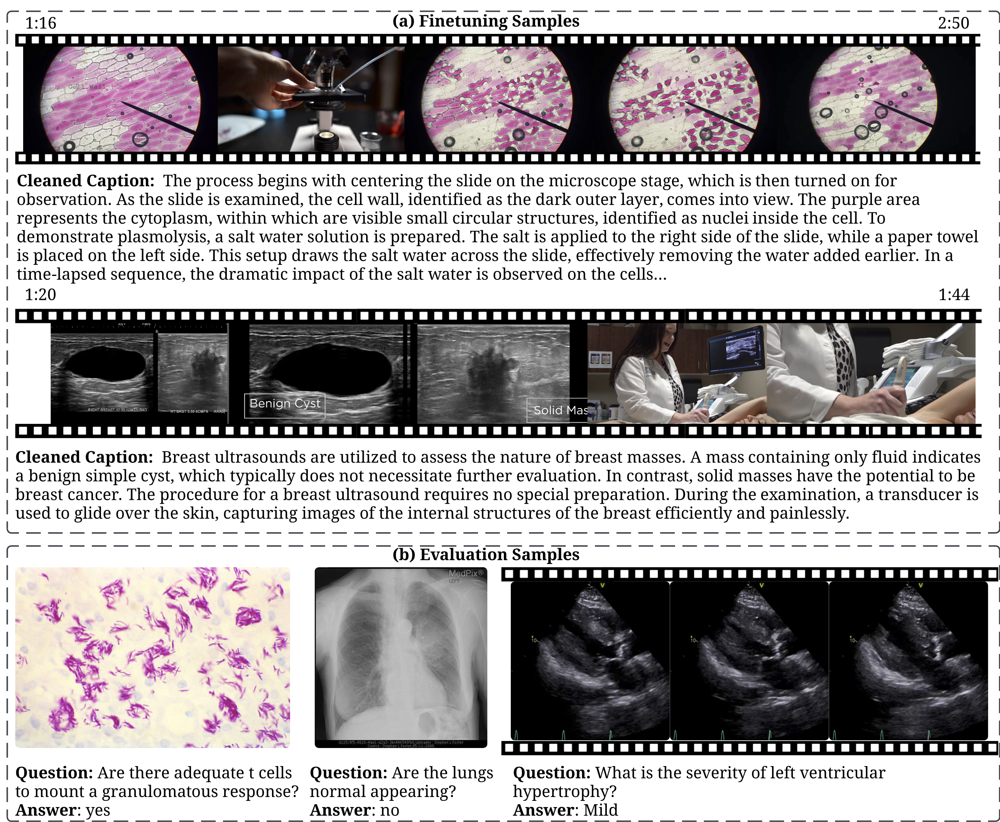
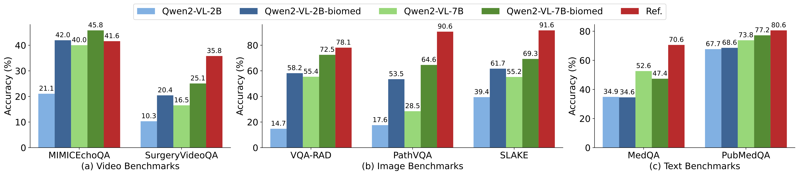
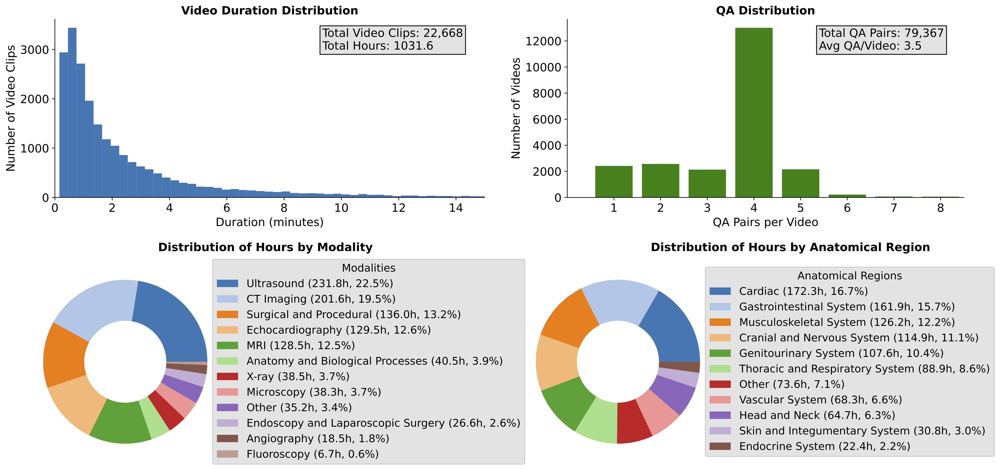

# Open Biomedical Video: How Well Can General Vision-Language Models Learn Medicine By Watching Public Educational Videos?

<!--- BADGES: START --->

<!--- BADGES: END --->

## Introduction

## Installation

## Run Video Pipeline

### Video Segmentation

### Caption Generation

## Training

## Run Inference on Benchmarks

## Experiments

### Main results
<a align="center">
    
    <!-- Text. -->
</a>

### Dataset Statistics
<a align="center">
    
    <!-- Text. -->
</a>

### Citation

### Our Team
<table>
	<tbody>
		<tr>
            <td align="center">
                <a href="https://rthapa84.github.io/">
                    
                     
                    <b>Rahul Thapa</b>
                </a>
            </td>
            <td align="center">
                <a href="https://www.linkedin.com/in/andrewli2403/">
                    
                     
                    <b>Andrew Li</b>
                </a>
            </td>
            <td align="center">
                <a href="https://www.linkedin.com/in/qingyang-wu-2497a0110/">
                    
                     
                    <b>Qingyang Wu</b>
                </a>
            </td>
            <td align="center">
                <a href="https://ai.stanford.edu/~bryanhe/">
                    
                     
                    <b>Bryan He</b>
                </a>
            </td>
            <td align="center">
                <a href="https://x.com/Yuki_Sahashi">
                    
                     
                    <b>Yuki Sahashi</b>
                </a>
            </td>
		</tr>
        <tr>
            <td align="center">
                <a href="https://www.linkedin.com/in/christina-binder-rodriguez-md-phd-690b6815b/">
                    
                     
                    <b>Christina Binder</b>
                </a>
            </td>
            <td align="center">
                <a href="https://scholar.google.com/citations?user=zafRY0sAAAAJ&hl=en">
                    
                     
                    <b>Angela Zhang</b>
                </a>
            </td>
            <td align="center">
                <a href="https://x.com/ben_athi?lang=en">
                    
                     
                    <b>Ben Athiwaratkun</b>
                </a>
            </td>
            <td align="center">
                <a href="https://shuaiwen-leon-song.github.io/">
                    
                     
                    <b>Shuaiwen Leon Song</b>
                </a>
            </td>
            <td align="center">
                <a href="https://douyang.github.io/">
                    
                     
                    <b>David Ouyang</b>
                </a>
            </td>
        </tr>
        <tr>
            <td align="center">
                <a href="https://www.james-zou.com/">
                    
                     
                    <b>James Zou</b>
                </a>
            </td>
        </tr>
	<tbody>
</table>